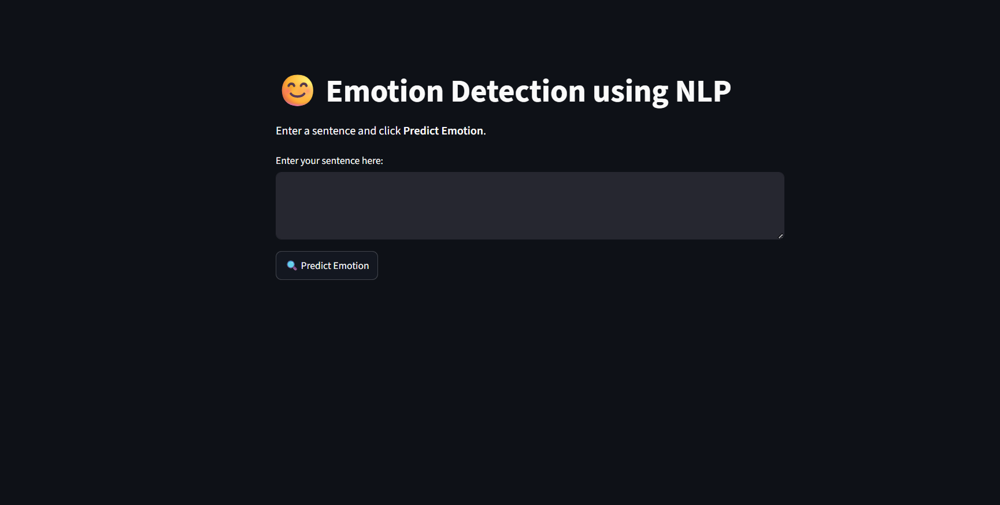
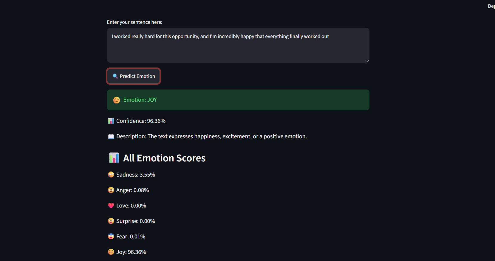

Workflow Description

1.User Input – The user enters text through the Streamlit interface.

2.Text Processing – The input is prepared for feature extraction.

3.Feature Extraction – CountVectorizer converts the text into numerical features.

4.Model Inference – The numerical representation is passed to the trained classifier.

5.Emotion Prediction – The model identifies the corresponding emotion.

6.Result Display – The prediction is presented through the Streamlit interface.

Frontend
The application uses Streamlit as the frontend framework.

The interface allows users to:

1.Enter textual input.
2.Submit the text for analysis.
3.Receive the predicted emotion.
4.View the prediction in a structured format.

Application Preview

Add your actual Streamlit screenshot here:

| Category                 | Technology      |
| ------------------------ | --------------- |
| Programming Language     | Python          |
| Machine Learning         | Scikit-learn    |
| NLP / Feature Extraction | CountVectorizer |
| Data Processing          | Pandas          |
| Model Serialization      | Joblib          |
| Frontend                 | Streamlit       |

Example Output

Input:
I am extremely happy with the results!
Output:
Predicted Emotion: Joy

Project Structure

emotion-detection/

──> app.py

──> emotion_model.pkl

──> count_vectorizer.pkl

──> requirements.txt

──>README.md

─> assets/

    ─>app-preview.png
    
    ->app1-preview.png
    

  | File                   | Description                                                                       |
| ---------------------- | --------------------------------------------------------------------------------- |
| `app.py`               | Streamlit application responsible for model inference and displaying predictions. |
| `emotion_model.pkl`    | Serialized trained Machine Learning model.                                        |
| `count_vectorizer.pkl` | Fitted CountVectorizer used for text feature extraction.                          |
| `requirements.txt`     | Required Python dependencies.                                                     |
| `README.md`            | Project documentation.                                                            |

Key Highlights
1.End-to-end Natural Language Processing and Machine Learning implementation.
2.Automated emotion classification from textual input.
3.CountVectorizer-based feature extraction.
4.Persistent model artifacts using Joblib.
5.Real-time inference through Streamlit.
6.Interactive user-facing application.
7.Reproducible project setup using requirements.txt.
